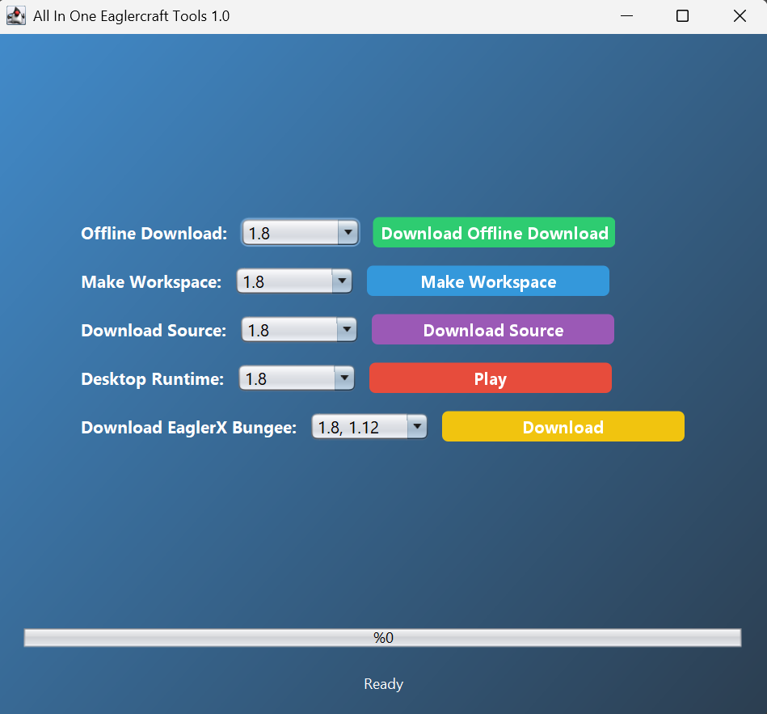

# EaglercraftX Desktop Launcher


A modern Java Swing application for downloading and managing EaglercraftX versions with desktop runtime support.

## Features

- **Multiple Version Support**:
  - Download offline versions (1.8, 1.8 WASM, 1.12.2, 1.12.2 WASM, 1.5.2, b1.3)
  - Create workspaces (1.8, 1.5.2)
  - Download decompiled sources (1.8, 1.5.2)
  - Desktop runtime (1.8, 1.12.2, 1.5.2, 1.3)
  - EaglerX Bungee (1.8, 1.12.2)

- **Modern UI**:
  - Gradient background
  - Custom styled buttons
  - Progress tracking

- **Smart Features**:
  - Existing file detection
  - Redownload confirmation
  - ZIP extraction
  - Automatic BAT file execution

## Screenshots

 <!-- Add your screenshot file -->

## Installation

1. **Requirements**:
   - Java 21 or higher
   - Internet connection for downloads

2. **Running the Application**:
   ```bash
   git clone https://github.com/yourusername/yourrepository.git
   cd yourrepository
   java -jar EaglercraftLauncher.jar
